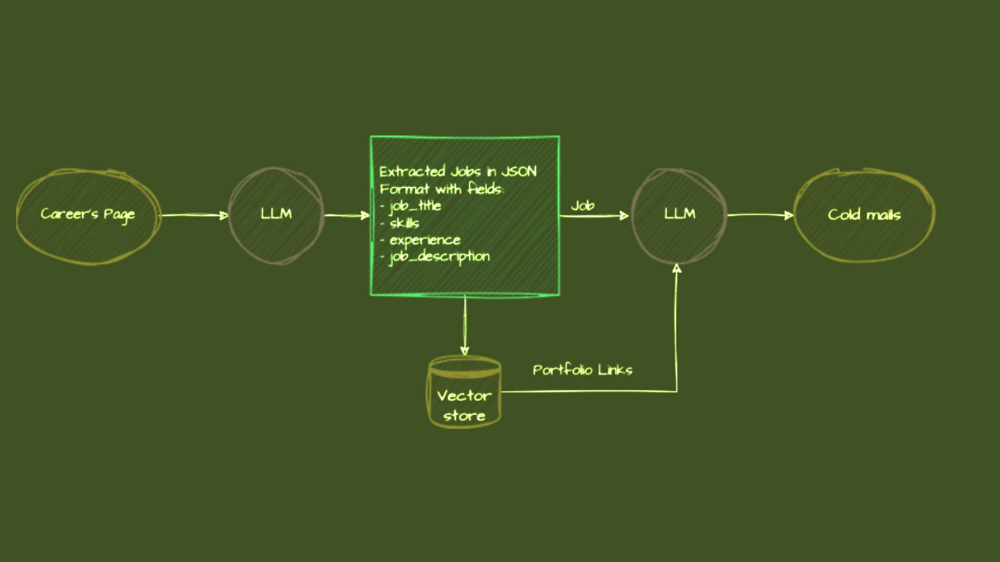

# 🚀 **Smart Job Outreach Tool**

An intelligent outreach tool by **HelferTech** built using **Groq**, **LangChain**, and **Streamlit**. This tool simplifies job-based outreach by analyzing company job postings, matching requirements with your services, and crafting targeted emails. It helps business development teams engage potential clients quickly and effectively.

---

## **Why Use This Tool?**

Imagine this:

- **XYZ Inc.** has posted a job for a **Senior Backend Developer** and is navigating long hiring cycles, onboarding hassles, and high costs.
- **HelferTech** provides on-demand backend engineering teams to help companies scale without the overhead.
- A business executive from HelferTech can use this tool to generate an impactful, customized email to connect with **XYZ Inc.** and pitch a solution directly aligned with their hiring needs.

---

## **How It Works**

1. **Input the Job URL**: Provide the careers page link where job openings are listed.
2. **Data Extraction**: The tool extracts job listings, including the role, required skills, and description.
3. **Portfolio Matching**: It connects relevant portfolio projects or case studies stored in the **Vector Database**.
4. **Personalized Email Generation**: Generates tailored cold emails highlighting HelferTech's offerings for the specific job role.

---

## **Architecture Overview**



### Key Components:
1. **Careers Page**: Source of job listings.
2. **LLM Processing**: Extracts structured data such as skills, experience, and job description.
3. **Vector Database**: Stores project links or case studies for portfolio matching.
4. **Streamlit Interface**: User-friendly tool for outreach email generation.

---

## **Setup Instructions**

### 1. Get an API Key:
   - Obtain a **Groq API Key** from: [Groq Console](https://console.groq.com/keys).
   - Add the key to your `.env` file in the `app` directory:
     ```plaintext
     GROQ_API_KEY=your_api_key_here
     ```

### 2. Install Dependencies:
   Run the following command to set up the environment:
   ```bash
   pip install -r requirements.txt
   ```

### 3. Run the App:
   Start the Streamlit app using:
   ```bash
   streamlit run app/main.py
   ```

---

## **Benefits**
- Automates outreach for your sales teams.
- Saves time in crafting cold emails.
- Ensures highly personalized communication for better conversion.
- Leverages past work to showcase HelferTech's expertise.

---

**Example Scenario:**
- A job posting is found for a **Cloud Solutions Architect**.
- The tool analyzes the job description and includes portfolio projects where HelferTech delivered similar solutions.
- A custom email is generated, positioning HelferTech as the ideal partner to provide an expert cloud solutions team.

---

**Supercharge your outreach with precision and speed.**

_HelferTech: Simplifying job-based client engagement!_ 🚀
